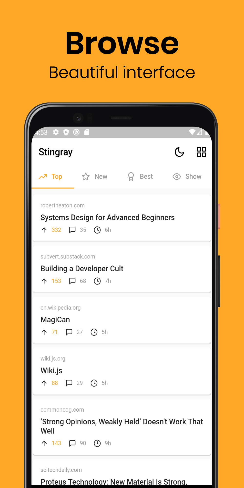
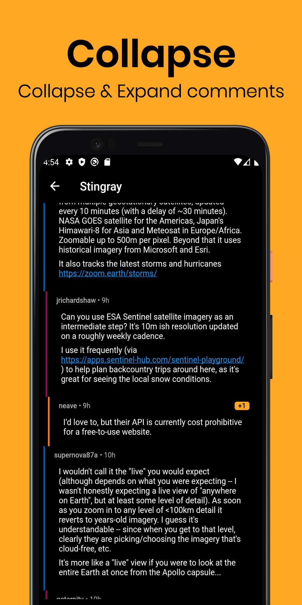

# Stingray

Stingray is a new, modern, beautiful Hacker News reader app.

  
  
  
  

> Images made with [previewed.app](previewed.app)

There are a bunch of nice looking Reddit apps, but I have not been able to find similarly nice looking one for Hacker News, so I decided to try my hands at one using Flutter.

Right now it's pretty basic, it's missing a couple of features such as:
- No refresh
- No login
- No upvote
- No reply
- No submission

Most of them are related to login/auth (Hacker News does not have an API for it), but there exists some solution to hack around it, for reference:
- https://swizec.com/blog/reverse-engineered-hacker-news/swizec/7741
- https://github.com/hidroh/materialistic

Contributions are welcomed!
